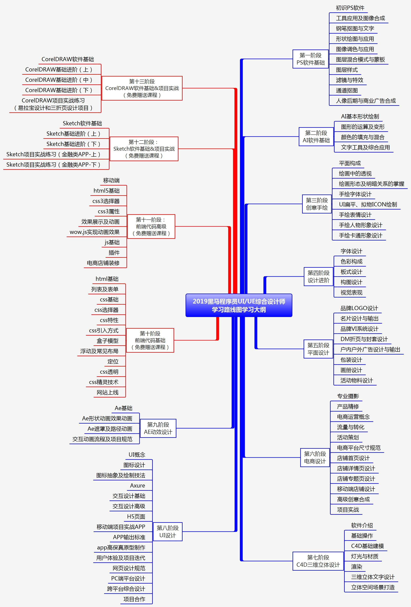

# Design-100-days
记录学习设计的一些学习资料和学习过程，希望能对一些想入门设计的开发者有些帮助。  

## 学习路线图
看一本书的时候，最好先从目录看起，首先简单的过一下目录中有哪些知识点，了解下我们学习完这些技术能解决工作当中的哪些问题，带着问题去学。也了解下那些技术是现在迫切需要使用的，可以进行一个轻重缓急的判断，然后再根据这个进行学习规划。  
学一门技术的时候，最好也有个目录大纲，除了上面那两个优势之外，可以清楚的知道自己现在学到那里了，还有那些知识是自己需要掌握的，对自己的学习进度也有一个系统的了解。  
黑马程序员列出了一个设计师的学习路线图，对掌握学习进度有很大的帮助。

    

## 学习资料
### 1. [黑马程序员2018版UI/UE学习路线图配套资源](./学习资料/黑马程序员2018版UIUE学习路线图配套资源.txt)
#### 推荐指数 ⭐️⭐️⭐️⭐️

这套教程非常全面、详细，包括PS、AI、Sketch从入门到精通的视频资料和实际练习素材。  
如果你正在使用Mac电脑，并且从未接触过设计，**强烈建议首先从Sketch入手学习**，因为入门门槛很低，会极大的增强学习热情。  

### 2. [PhotoShop 2018大师课](https://www.bilibili.com/video/av59906341?from=search&seid=13389478556968547014)  
网易云课堂售价99元，B站可以免费观看。  
Adobe认证专家 · 全球Top10讲师 · 设计师网站创始人讲解。  
具体介绍可以看下面这张图片。  

    

### 3. [Ai大师课](https://www.bilibili.com/video/av54532407?from=search&seid=14469042763389166068)  
网易云课堂售价99元，B站可以免费观看。  
同一位讲师，课程看介绍。

    

### 4. [硅谷大神教Sketch三剑客炫酷设计](./学习资料/硅谷sketch.txt)  
网易云课堂售价99元的课程。
硅谷知名产品设计师从Sketch的基础讲起，同时介绍了Principle和Flinto。

    

<!---->

